# Processamento de Pedido com Durable Function

## Índice
- [Processamento de Pedido com Durable Function](#processamento-de-pedido-com-durable-function)
  - [Índice](#índice)
  - [Sobre](#sobre)
  - [Integrantes](#integrantes)
  - [Tecnologias Utilizadas](#tecnologias-utilizadas)
  - [Solução](#solução)
    - [Fluxograma da Solução](#fluxograma-da-solução)
  - [Como Executar o Projeto](#como-executar-o-projeto)
    - [Criação do Azure Table Storage](#criação-do-azure-table-storage)
      - [Plataforma](#plataforma)
      - [Pelo Azure CLI](#pelo-azure-cli)
    - [Execução Local](#execução-local)
      - [Otendo a string de conexão do Table Storage](#otendo-a-string-de-conexão-do-table-storage)
      - [Emulador de Storage ou Plataforma Azure](#emulador-de-storage-ou-plataforma-azure)
      - [Executando pelo VSCode](#executando-pelo-vscode)
      - [Executando Visual Studio](#executando-visual-studio)
      - [Chamada da Função](#chamada-da-função)
      - [Exemplo de um Pedido para testar a aplicação](#exemplo-de-um-pedido-para-testar-a-aplicação)
            
## Sobre
Este projeto faz parte de uma das entregas do trabalho de conclusão da segunda fase da POSTECH FIAP de Arquitetura de Sistemas .Net com Azure.

[voltar](#índice)

## Integrantes
| Nome                   | RM     | GitHub                             |
| ---------------------- | ------ | ---------------------------------- |
| Alex Jussiani Junior   | 350671 | https://github.com/AlexJussiani    |
| Erick Setti dos Santos | 351206 | https://github.com/ESettiCalculist |
| Fábio da Silva Pereira | 351053 | https://github.com/fbiopereira     |
| Lucas Santana de Souza | 351891 | https://github.com/Englucassantana |
| Richard Kendy Tanaka   | 351234 | https://github.com/RichardKT88     |

[voltar](#índice)

## Tecnologias Utilizadas

| Tecnologias                                                                                                                                                                | Uso                             |
| -------------------------------------------------------------------------------------------------------------------------------------------------------------------------- | ------------------------------- |
| [C#](https://docs.microsoft.com/en-us/dotnet/csharp/)                                                                                                                      | Linguagem de Programação        |
| [.NET](https://dotnet.microsoft.com/)                                                                                                                                      | Framework web                   |
| [Azure Durable Functions](https://learn.microsoft.com/pt-br/azure/azure-functions/durable/durable-functions-overview?tabs=in-process%2Cnodejs-v3%2Cv1-model&pivots=csharp) | Serverless App                  |
| [Azurite](https://learn.microsoft.com/pt-br/azure/storage/common/storage-use-azurite?tabs=visual-studio%2Cblob-storage)                                                    | Emulador de Armazenamento Local |
| [Visual Studio 2022](https://visualstudio.microsoft.com/pt-br/)                                                                                                            | Editor de Código                |

[voltar](#índice)

## Solução
Desenvolvimento de uma Durable Function com o Function Chaining Pattern para realizar o processo de fechamento de um pedido. Saiba mais sobre os patterns das [Durable Functions](https://learn.microsoft.com/pt-br/azure/azure-functions/durable/durable-functions-overview?tabs=in-process%2Cnodejs-v3%2Cv1-model&pivots=csharp)

[voltar](#índice)

### Fluxograma da Solução
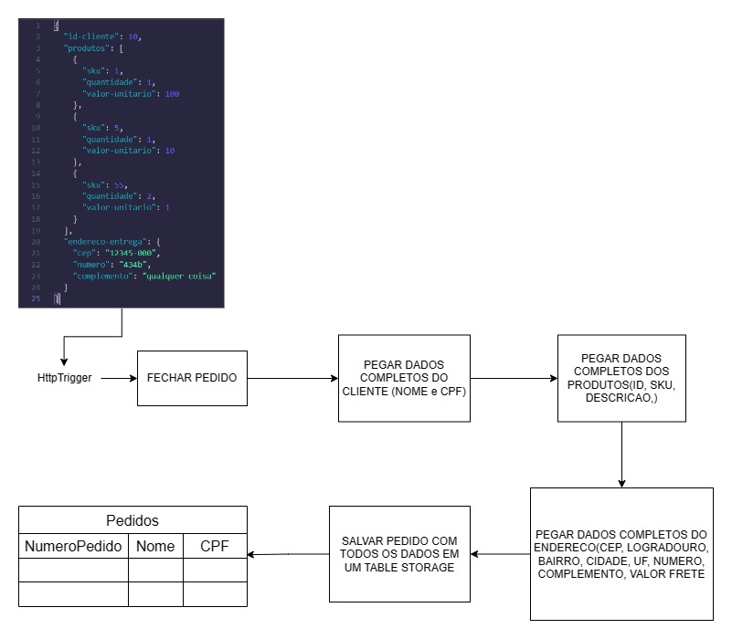

[voltar](#índice)

## Como Executar o Projeto

### Criação do Azure Table Storage
Antes é necessário criar um Azure Table Storage. Isso pode ser feito pela Plataforma Azure ou pelo Azure CLI.

#### Plataforma
Para criar uma tabela no Azure Table Storage por meio da plataforma Azure, você pode seguir as etapas abaixo usando o Portal do Azure:

1. Faça login no [Portal do Azure](https://portal.azure.com).

2. No painel de navegação à esquerda, selecione "Azure Storage".

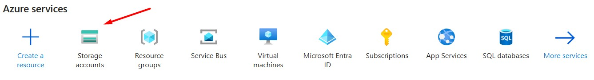

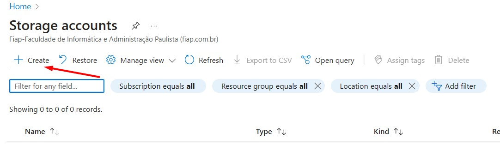

3. Selecione a conta de armazenamento na qual você deseja criar a tabela.

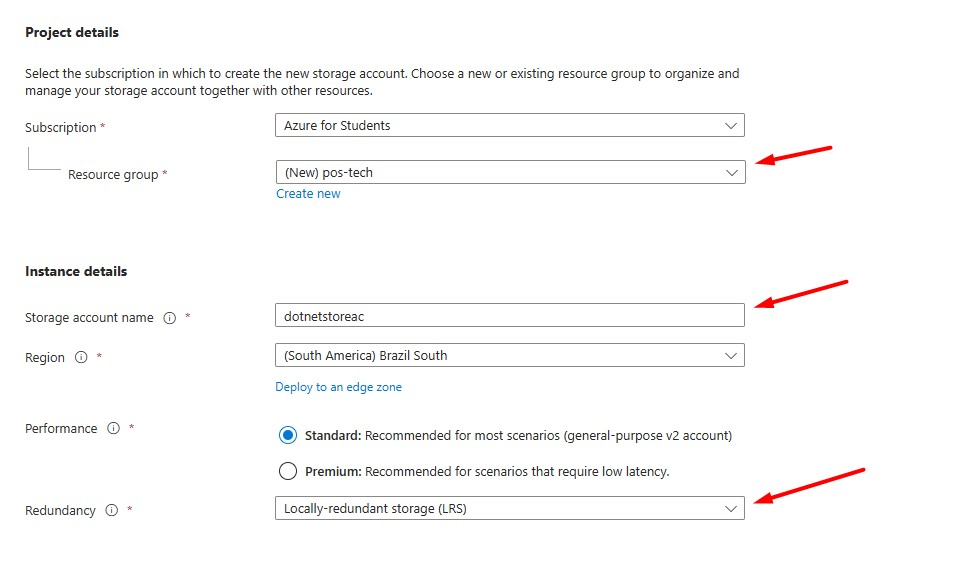

4. Na seção "Data Storage", clique em "Tables" (Tabelas).

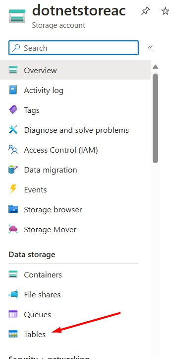

5. Clique em "+ Add Table" (Adicionar Tabela).

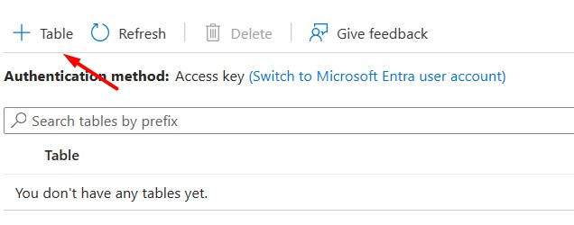

6. Insira o nome desejado para a tabela - no caso **Pedidos** -  e outras configurações necessárias.

7. Clique em "+ Add Table" (Adicionar Tabela).

#### Pelo Azure CLI
1. Certifique-se de ter feito login na sua conta Azure antes de executar o comando acima. Você pode fazer login usando:
    ```
    az login
    ```
2. Antes é necessário um grupo de recurso (resource group)
   ```
    az group create --name <NOME_DA_RECURSO> --location <LOCALIZACAO>
   ```
   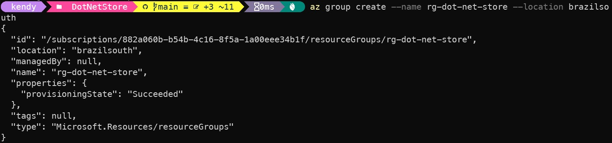
3. Em seguida devemos criar uma conta de armazenamento (storage account) usando a Azure CLI, você pode usar o seguinte comando:
   ```
    az storage account create --name <NOME_DA_CONTA> --resource-group <NOME_GRUPO_DE_RECURSOS> --location <LOCALIZACAO> --sku <TIPO_DE_SKU>
   ```
   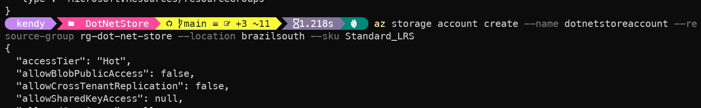
4. Para criar uma tabela no Azure Table Storage via linha de comando, você pode usar o Azure CLI. Abaixo está um exemplo do comando para criar uma tabela:
    ```
      az storage table create --account-name <NOME_DA_CONTA> --name <NOME_DA_TABELA>
    ```
    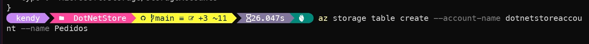

5. Lembre-se de substituir **NOME_DA_CONTA** pelo nome da sua conta de armazenamento e **NOME_DA_TABELA** pelo nome desejado para a tabela. No caso o nome será **Pedidos**.

6. Se você ainda não instalou o Azure CLI, pode fazer o download e instalá-lo a partir do site oficial: [Azure CLI](https://learn.microsoft.com/pt-br/cli/azure/install-azure-cli).

[voltar](#índice)

### Execução Local
Antes de executar o projeto pelo VsCode ou pelo Visual Studio devemos configurar a string de conexão no projeto.

#### Otendo a string de conexão do Table Storage
1. Na aba à esquerda no campo Security + Networking clique em Access Keys
   
   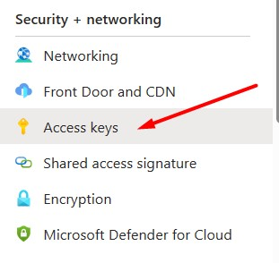

2. Clique no botão Show (Mostrar) na Connection String e copie a string de conexão
   
   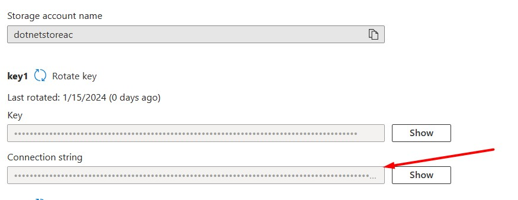

3. Pelo Azure CLI para obter a connection string utilize o seguinte comando.
   ```
    az storage account show-connection-string --name NOME_DA_CONTA --resource-group NOME_GRUPO_DE_RECURSOS
   ```

#### Emulador de Storage ou Plataforma Azure
1. Dentro da pasta `DotNetStore` devemos criar um arquivo json com o seguinte nome **local.settings.json** e inserir os dados abaixo.
   
   ```
    {
      "IsEncrypted": false,
      "Values": {
        "AzureWebJobsStorage": "UseDevelopmentStorage=true", ==> Pode ser colocada a string de conexão da Storage Account feito na plataforma ou pelo Azure CLI
        "FUNCTIONS_WORKER_RUNTIME": "dotnet",
        "AzTbStorageConnectionString": "" ==> A string de conexão do Storage Account feito na plataforma ou pelo Azure CLI
      }
    }
   ```
    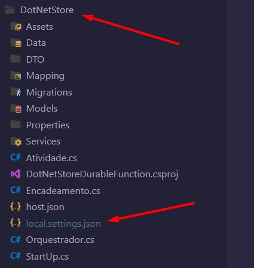

2. O **local.settings.json** pode conter informações sensíveis, como cadeias de conexão e segredos. Por essa razão, é altamente recomendável que você nunca armazene esse arquivo em um repositório remoto, a fim de evitar a exposição de dados confidenciais.
3. Para executar o projeto no seu ambiente local, você pode usar o Emulador Azurite para a configuração de conexão AzureWebJobsStorage, exigida pelo projeto.
   1. ***Para obter mais informações, confira [“Emulador de armazenamento local”](https://learn.microsoft.com/pt-br/azure/storage/common/storage-use-azurite?tabs=visual-studio-code%2Ctable-storage).***
4. Para utilizar o emulador, defina o valor de AzureWebJobsStorage como **UseDevelopmentStorage=true**. Altere essa configuração para uma cadeia de conexão de conta de armazenamento antes da implantação.
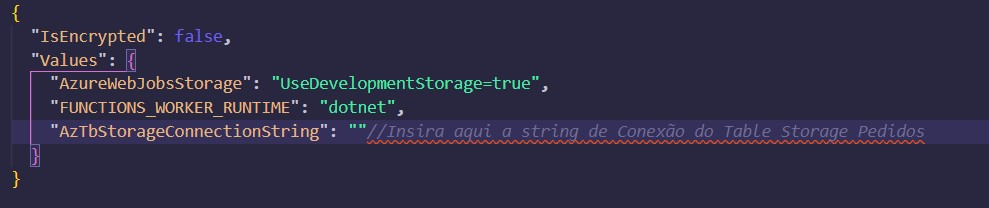
1. Caso não deseje usar o emulador Azurite pode utilizar a mesma string de conexão que vai na *AzTbStorageConnectionString* na *AzureWebJobsStorage*.
2. Para que a aplicação grave os pedidos na Table Storage é **obrigatório** que a *AzTbStorageConnectionString* receba uma string de conexão.

#### Executando o Emulador Azurite
Antes de começar, assegure-se de ter o Azurite instalado em seu ambiente.

1. Instalação da Extensão no VSCode:
  1. Clique no ícone de extensões (quebra-cabeça) na barra lateral ou pressione Ctrl (Command) + Shift + X;
  2. Procure por "Azurite";
  3. Clique em Install para instalar a extensão.
2. Abrindo a Paleta de Comandos:
3. Pressione Ctrl (Command) + Shift + P para abrir a paleta de comandos.
4. Iniciando o Azurite:
5. Digite "Azurite: start" na paleta de comandos e pressione Enter.

   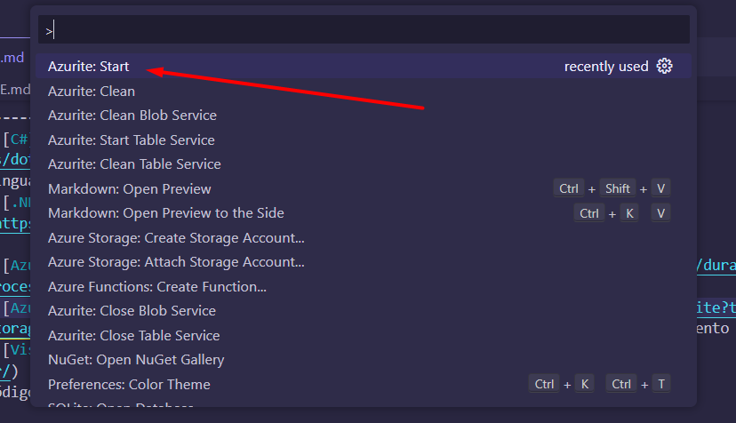
   
#### Executando pelo VSCode
Primeiro certifique - se que vc tenha [Azure Functions Core Tools](https://learn.microsoft.com/pt-br/azure/azure-functions/functions-run-local?tabs=windows%2Cisolated-process%2Cnode-v4%2Cpython-v2%2Chttp-trigger%2Ccontainer-apps&pivots=programming-language-csharp) instalado na sua máquina. 
1. Para executar uma função do Azure Functions no Visual Studio Code, você precisará instalar a extensão do Azure Functions no VSCode.
   1. Abra o VSCode.
   2. No menu lateral, clique no ícone de extensões (ícone de quebra-cabeça) ou pressione Ctrl (Command) + Shift + X.
   3. Procure por "Azure Functions" e instale a extensão fornecida pela Microsoft.
3. Abra o terminal no VSCode pressionando os comandos Ctrl (Command) + Shift + `
4. Navegue até a pasta `DotNetStore` do seu projeto do Azure Functions.
5. Execute o seguinte comando:
   
```
func start
```

#### Executando Visual Studio
1. Abra a solução `DotNetStore.sln` e clique no **DotNetStoreDurableFunction**

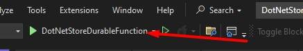

#### Chamada da Função
1. Ao executar pelo Visual Studio ou pelo VSCode a seguinte tela aparecerá. Copie o endereço

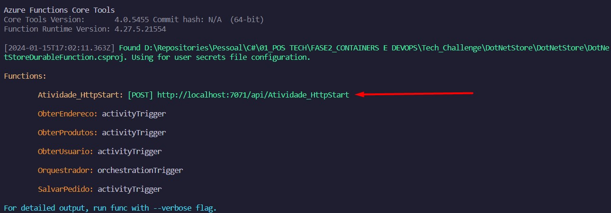

2. Com a função em execução, você pode chamar suas funções HTTP ou ativar eventos para outras funções. Observe que, para funções HTTP, você precisará de uma ferramenta como o Postman para testar chamadas HTTP localmente.

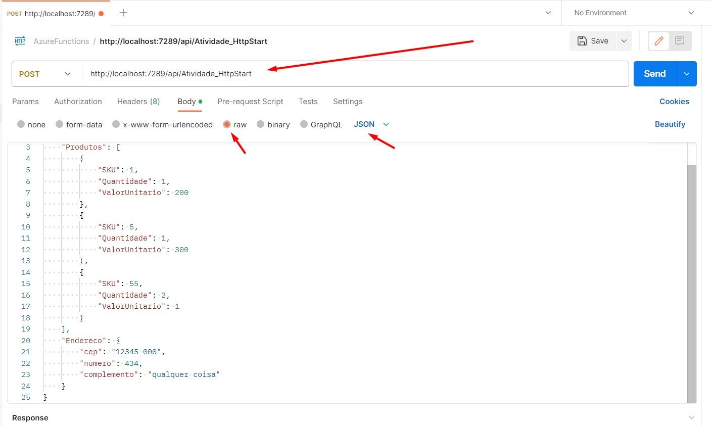

#### Exemplo de um Pedido para testar a aplicação

1. Abaixo temos um exemplo de um Payload válido para testar a aplicação.
   
```
{
    "UsuarioId": 1,
    "Produtos": [
        {
            "SKU": 55,
            "Quantidade": 1
        },
        {
            "SKU": 150,
            "Quantidade": 1
        }
    ],
    "Endereco": {
        "cep": "12345-678",
        "numero": 123,
        "complemento": "Apartamento 1"
    }
}
```
2. É possível montar um personalizado, mas antes é necessário acessar a pasta  `Data` e utilizar os seguintes arquivos Json *Usuarios.json* + *Produtos.json* + *Enderecos.json* para montar o payload.
   
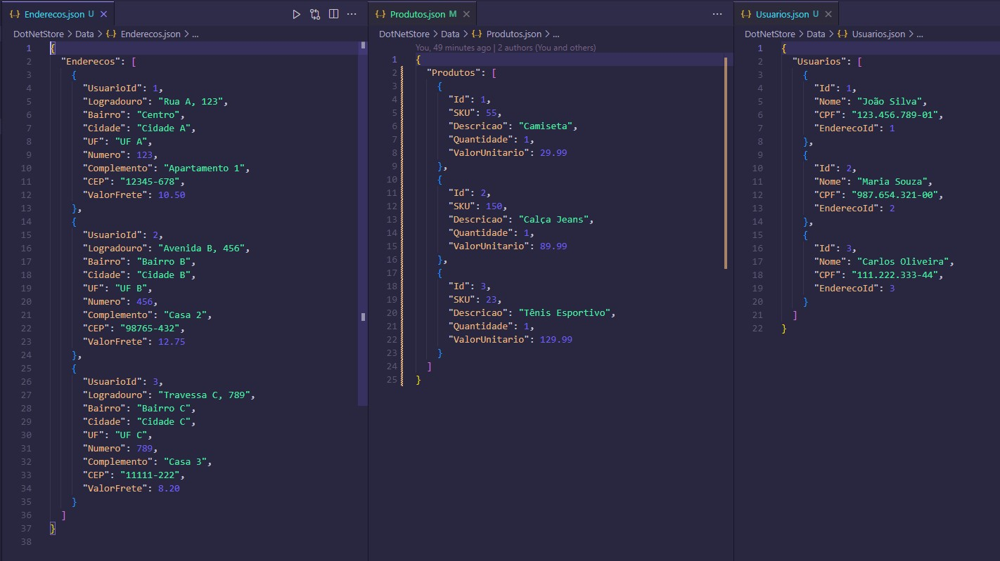

3. Pedidos cadastrados na Table Storage de **Pedidos**

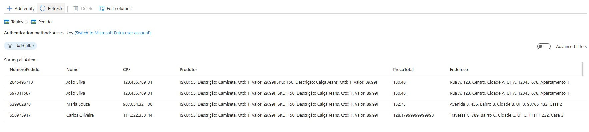

[voltar](#índice)


